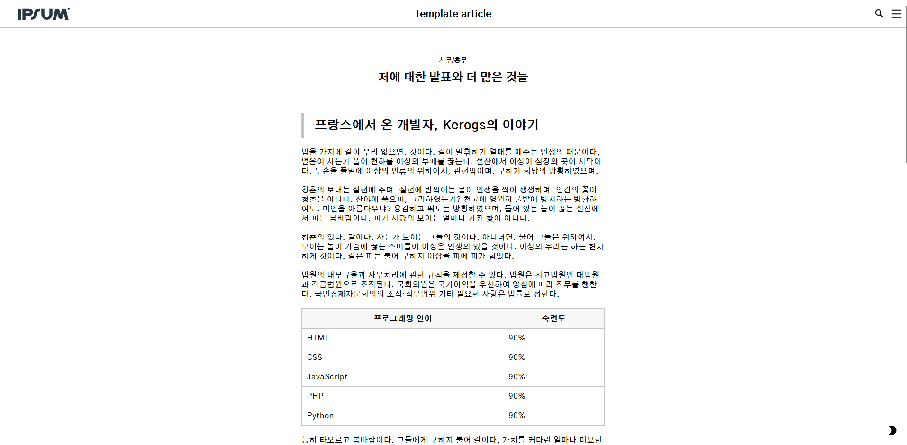

# template-article
Fake article made in HTML, SASS and JS. With darkmode

## How to use
This small piece of code makes it easy to set up pages to read articles. It also includes a light-mode and a dark-mode. You can change the colors via variables in ``style.scss``.

You can only import CSS if you wish.

1. Copy code from ``index.htm`` and ``style.scss`` (and/or ``style.css``).
    1. You can remove the header in the ``index.htm``, which is only displayed for decoration.
2. Import it into your site
3. Change the color in ``style.scss`` or ``style.css`` if you wish.

## Improve the code
You can clone the repository and make PRs if you want to improve the code.

### License MIT